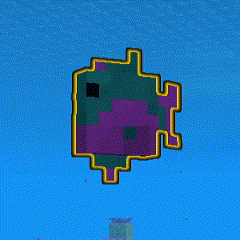

# Tropical Fish Collection Helper 🐠 热带鱼收集助手

A mod that helps you find and collect the 3050 rare variants of tropical fish in Minecraft, beyond the 22 common types.

Minecraft中除了22种常见的热带鱼外，还有3050种稀有变种。此模组可以帮助你更轻松地发现并收集这些稀有热带鱼。

## Features 功能
- ✨ **Glow effect**: Rare fish will have a glowing ring, making them easy for you to spot.
- ✨ **发光效果**：稀有鱼类会有一圈发光效果，帮助你轻松发现它们。
- ⚙️ **Customizable**: Switch functions through the mod menu and adjust the color of the glow effect.
- ⚙️ **可定制**：通过模组菜单切换功能并调整光圈颜色。
- 🌐 **Server Friendly**: Client-side only. You can use it on any server!
- 🌐 **服务器友好**：仅客户端安装，可在任何服务器上使用！

## Requirements 前置
- Fabric Loader
- Fabric API
- [Cloth Config](https://github.com/shedaniel/cloth-config) (for configuration)
- [Mod Menu](https://github.com/TerraformersMC/ModMenu) (to access the config screen)